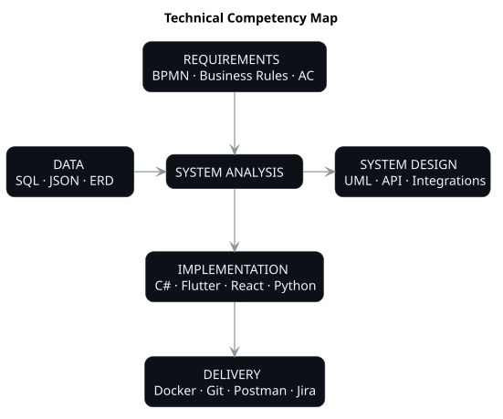

  

  <strong>Real systems. Real constraints. Analysis that can be implemented.</strong>

---

## Selected Cases

<table>
<tr>
<td width="12%" align="center" valign="middle">
<h1>01</h1>
</td>

<td width="68%" valign="top">

<strong>ENTERPRISE IT</strong>

<h2>Workplace OS Migration</h2>

<em>Large-scale change under production constraints.</em>

System analysis of a phased Windows → Astra Linux migration across a large enterprise workplace environment.

<code>Requirements</code>
<code>Dependencies</code>
<code>Rollout Logic</code>
<code>State Model</code>
<code>Process Design</code>

</td>

<td width="20%" align="center" valign="middle">

</td>
</tr>
</table>

 

<table>
<tr>
<td width="12%" align="center" valign="middle">
<h1>02</h1>
</td>

<td width="68%" valign="top">

<strong>BIM AUTOMATION</strong>

<h2>Rebar AutoDim</h2>

<em>Deterministic geometry automation inside Autodesk Revit.</em>

System analysis and solution design for automated dimensioning of rectangular Area Reinforcement zones in Revit 2025.

<code>System Design</code>
<code>Geometry</code>
<code>Revit API</code>
<code>Placement Logic</code>
<code>Idempotency</code>

</td>

<td width="20%" align="center" valign="middle">

</td>
</tr>
</table>

---

## How I Work Across the System

  

  System analysis connected to requirements, architecture, data, implementation and delivery.

---

## Tools & Technologies

  
  
  
  
  
  
  
  

  Development experience is part of the analysis workflow, not a separate track.

---

## Navigation

  
  &nbsp;
  

