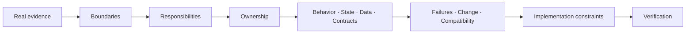
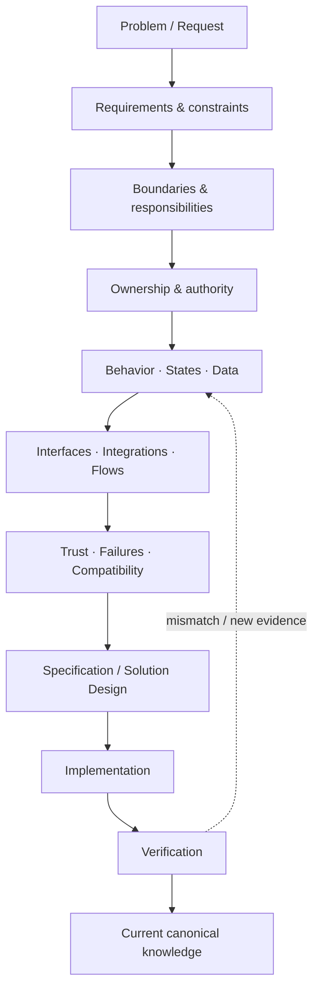

<p align="center">
  
</p>

<p align="center">
  <strong>Three materially different real systems. One implementation-aware system-analysis approach.</strong>
</p>

<p align="center">
  I analyze boundaries, responsibilities, ownership, behavior, state, data, contracts and failures — and keep the model connected to real implementation constraints.
</p>

<p align="center">
  <a href="README.md"><strong>EN</strong></a> · <a href="README_RU.md">RU</a>
</p>

<p align="center">
  <a href="https://github.com/branch-danya-dev">
    
  </a>
  &nbsp;
  <a href="https://github.com/branch-danya-dev/ssad-methodology">
    
  </a>
</p>

---

## Portfolio thesis

The portfolio is intentionally not built around a repeated artifact set such as `requirements + ERD + Swagger + sequence diagram`.

The systems have different shapes, so their analytical knowledge has different structures.



> **The goal is not to produce documents. The goal is to preserve correct system meaning from problem framing through implementation and verification.**

---

## Portfolio at a glance

| Case | System shape | Main analytical challenge | Evidence / status |
|---|---|---|---|
| **Enterprise Workplace OS Migration** | distributed enterprise transformation | aggregate readiness and controlled migration across independently owned domains | sanitized reconstruction of a real enterprise migration; technical API/data projection is explicitly synthetic |
| **Aveli** | local-first mobile product | separate professional workspace ownership from server-controlled identity, access and billing | real product system-analysis case with frontend/backend/local-data/integration boundaries |
| **Rebar AutoDim** | host-application automation | preserve analytical meaning across view geometry, Revit references, native writes and regeneration | real implemented Revit plugin; accepted by the customer and introduced into regular company use |
| **SSAD** | methodology layer | generalize the reasoning without forcing one repository template | formalized methodology validated across all three system shapes |

---

## 01 · Enterprise Workplace OS Migration

**Large-scale change under production constraints.**

[Open case →](https://github.com/branch-danya-dev/enterprise-workplace-os-migration)

The analytical object is not simply “install Astra Linux”. It is the controlled evolution of an employee workplace while preserving the ability to perform required business activity.

### What the analysis exposed

```text
one broad migration_status
        ↓ decomposed into
Workplace Environment
Readiness
Planning
Execution
Exceptions
```

Key distinctions:

```text
Astra installed
!= operational migration complete

MigrationSchedule
!= MigrationAttempt

distributed evidence
!= distributed ownership of the readiness decision

blocker resolved
!= readiness automatically GREEN
```

Current system-shaped knowledge areas:

```text
system/
workplace/
readiness/
planning/
execution/
exceptions/
integrations/
technical-projection/
```

The case also demonstrates how corrected domain ownership changes a technical projection: generic status updates were replaced by owner-specific operations, and reporting became a derived read model rather than a second source of truth.

> **Case boundary:** the migration experience is real and sanitized; REST/OpenAPI/PostgreSQL artifacts are educational technical projections created after the real programme.

---

## 02 · Aveli

**Local-first mobile workspace with explicit ownership and bounded offline trust.**

[Open case →](https://github.com/branch-danya-dev/aveli-system-analysis)

Aveli separates two concerns with very different ownership and availability requirements:

```text
Professional Workspace
→ local device
→ clients, appointments, payments, notes, photos

Identity / Access / Billing
→ backend
→ account, sessions, trial, grants, subscription, access decision
```

### What the analysis protects

```text
RevenueCat / Store
→ billing evidence

Aveli Backend
→ normalized billing state
→ final workspace-access decision
```

Key distinctions:

```text
purchase evidence
!= workspace access authority

access expired
!= delete professional data

backend unavailable
!= workspace deleted

offline cache
!= unlimited trust
```

Current system-shaped knowledge areas:

```text
business/
database/
backend/
frontend/
integrations/
system/
```

This case demonstrates local/server data ownership, narrow backend API boundaries, access precedence, billing reconciliation, offline trust and whole-system failure/release reasoning.

---

## 03 · Rebar AutoDim

**Deterministic geometry automation inside Autodesk Revit 2025.**

[Open case →](https://github.com/branch-danya-dev/revit-rebar-autodim-analysis)

The plugin reads structural truth from Revit and owns only the generated annotation layer.

### What the analysis exposed

```text
what should be dimensioned
→ semantic target

how Revit can dimension it
→ native Reference realization
```

Key distinctions:

```text
view-space geometry
!= project XYZ assumptions

semantic target
!= Revit Reference

missing optional grid
!= failed native dimension

valid geometry
!= committed annotation result

rerun
!= append duplicate output
```

Current system-shaped knowledge areas:

```text
system/
execution-context/
geometry/
references/
layout/
annotations/
regeneration/
revit-boundary/
evidence/
```

A transaction per independently meaningful zone provides local failure isolation, while regeneration maintains one current plugin-owned annotation result per source zone.

> **Outcome:** the solution was implemented, accepted by the customer and introduced into regular company use.

---

## SSAD · System-Structured Analysis Documentation

**A practical system-analysis methodology I designed, formalized and applied across the portfolio.**

[Open methodology →](https://github.com/branch-danya-dev/ssad-methodology)

SSAD structures analytical knowledge around real system boundaries, responsibilities and ownership rather than a universal document taxonomy.

The three cases deliberately produce different repository structures:

```text
Aveli
→ product-shaped

Enterprise Workplace Migration
→ transformation-shaped

Rebar AutoDim
→ host-application-shaped
```

The commonality is the reasoning model:

```text
Boundaries
→ Responsibilities
→ Ownership
→ Local models
→ Connections
→ System synthesis
```

> **Same analytical principles. Different system-shaped knowledge architecture.**

The methodology repository also covers the real analyst workflow, change analysis, collaboration, knowledge architecture, task-based practice and comparative real-world validation.

---

## How I work across a system



My strongest focus is the middle of this chain: making system meaning explicit enough that requirements, contracts, implementation and verification do not silently diverge.

---

## Core competencies demonstrated by the cases

**System analysis:** boundaries, responsibilities, ownership, requirements, business rules, behavior, state models, data ownership, interfaces, integrations, trust, failures and change impact.

**Contracts & data:** REST/OpenAPI, JSON contracts, SQL/PostgreSQL modeling, read models, idempotency and compatibility-aware projections.

**Implementation awareness:** C#/.NET and Revit API, Flutter/Dart, NestJS/Prisma, local SQLite/Drift, Docker, Git/GitHub and production-oriented failure reasoning.

**Modeling tools:** Mermaid, PlantUML, UML/BPMN where they clarify a system question rather than define the knowledge architecture.

---

## Suggested review routes

```text
Want the broadest enterprise case?
→ Enterprise Workplace OS Migration

Want product / API / data / offline behavior?
→ Aveli

Want deep implementation-aware boundary reasoning?
→ Rebar AutoDim

Want the reasoning model behind all three?
→ SSAD
```

---

<p align="center">
  <a href="https://github.com/branch-danya-dev">
    
  </a>
  &nbsp;
  <a href="https://github.com/branch-danya-dev/ssad-methodology">
    
  </a>
</p>
