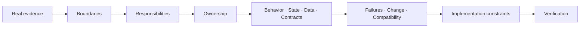
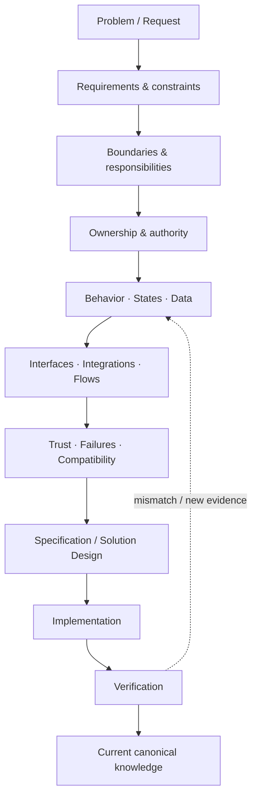

<p align="center">
  
</p>

<p align="center">
  <strong>Три существенно разные реальные системы. Один implementation-aware подход к системному анализу.</strong>
</p>

<p align="center">
  Я анализирую boundaries, responsibilities, ownership, behavior, states, data, contracts и failures — и сохраняю связь модели с реальными ограничениями реализации.
</p>

<p align="center">
  <a href="README.md">EN</a> · <a href="README_RU.md"><strong>RU</strong></a>
</p>

<p align="center">
  <a href="https://github.com/branch-danya-dev">
    
  </a>
  &nbsp;
  <a href="https://github.com/branch-danya-dev/ssad-methodology">
    
  </a>
</p>

---

## Идея портфолио

Портфолио намеренно не строится вокруг повторяющегося набора артефактов вида `requirements + ERD + Swagger + sequence diagram`.

Системы имеют разную форму, поэтому их аналитическое знание имеет разную структуру.



> **Цель не в производстве документов. Цель — сохранить корректный системный смысл от постановки проблемы до реализации и проверки.**

---

## Портфолио в одном обзоре

| Кейс | Форма системы | Главная аналитическая задача | Evidence / статус |
|---|---|---|---|
| **Enterprise Workplace OS Migration** | распределённая enterprise transformation | агрегировать readiness и управлять миграцией через независимо владеемые домены | sanitized reconstruction реальной enterprise-миграции; technical API/data projection явно обозначена как synthetic |
| **Aveli** | local-first mobile product | отделить ownership профессионального workspace от server-controlled identity, access и billing | real product system-analysis case с frontend/backend/local-data/integration boundaries |
| **Rebar AutoDim** | host-application automation | сохранить аналитический смысл через view geometry, Revit references, native writes и regeneration | реальный реализованный Revit-плагин; принят заказчиком и введён в регулярное использование |
| **SSAD** | methodology layer | обобщить reasoning без навязывания одного шаблона репозитория | формализованная методология, проверенная на всех трёх формах систем |

---

## 01 · Enterprise Workplace OS Migration

**Масштабное изменение enterprise-среды под production constraints.**

[Открыть кейс →](https://github.com/branch-danya-dev/enterprise-workplace-os-migration)

Объект анализа — не просто «установить Astra Linux». Это управляемая эволюция рабочего места с сохранением возможности выполнять необходимую бизнес-деятельность.

### Что обнаружил анализ

```text
one broad migration_status
        ↓ decomposed into
Workplace Environment
Readiness
Planning
Execution
Exceptions
```

Ключевые различия:

```text
Astra installed
!= operational migration complete

MigrationSchedule
!= MigrationAttempt

distributed evidence
!= distributed ownership of the readiness decision

blocker resolved
!= readiness automatically GREEN
```

Текущие system-shaped knowledge areas:

```text
system/
workplace/
readiness/
planning/
execution/
exceptions/
integrations/
technical-projection/
```

Кейс также показывает, как исправленный domain ownership меняет technical projection: generic status updates заменяются owner-specific операциями, а reporting становится derived read model, а не вторым источником истины.

> **Граница кейса:** опыт миграции реальный и sanitized; REST/OpenAPI/PostgreSQL артефакты — образовательные technical projections, созданные после реальной программы миграции.

---

## 02 · Aveli

**Local-first mobile workspace с явным ownership и bounded offline trust.**

[Открыть кейс →](https://github.com/branch-danya-dev/aveli-system-analysis)

Aveli разделяет две области с совершенно разными требованиями к ownership и availability:

```text
Professional Workspace
→ local device
→ clients, appointments, payments, notes, photos

Identity / Access / Billing
→ backend
→ account, sessions, trial, grants, subscription, access decision
```

### Что защищает анализ

```text
RevenueCat / Store
→ billing evidence

Aveli Backend
→ normalized billing state
→ final workspace-access decision
```

Ключевые различия:

```text
purchase evidence
!= workspace access authority

access expired
!= delete professional data

backend unavailable
!= workspace deleted

offline cache
!= unlimited trust
```

Текущие system-shaped knowledge areas:

```text
business/
database/
backend/
frontend/
integrations/
system/
```

Кейс показывает local/server data ownership, узкие backend API boundaries, access precedence, billing reconciliation, offline trust и whole-system failure/release reasoning.

---

## 03 · Rebar AutoDim

**Детерминированная geometry automation внутри Autodesk Revit 2025.**

[Открыть кейс →](https://github.com/branch-danya-dev/revit-rebar-autodim-analysis)

Плагин читает structural truth из Revit и владеет только собственным generated annotation layer.

### Что обнаружил анализ

```text
what should be dimensioned
→ semantic target

how Revit can dimension it
→ native Reference realization
```

Ключевые различия:

```text
view-space geometry
!= project XYZ assumptions

semantic target
!= Revit Reference

missing optional grid
!= failed native dimension

valid geometry
!= committed annotation result

rerun
!= append duplicate output
```

Текущие system-shaped knowledge areas:

```text
system/
execution-context/
geometry/
references/
layout/
annotations/
regeneration/
revit-boundary/
evidence/
```

Transaction на одну независимо значимую зону даёт локальную failure isolation, а regeneration поддерживает один актуальный plugin-owned annotation result для исходной зоны.

> **Результат:** решение было реализовано, принято заказчиком и введено в регулярное использование в компании.

---

## SSAD · System-Structured Analysis Documentation

**Практическая методология системного анализа, которую я разработал, формализовал и применил во всех кейсах портфолио.**

[Открыть методологию →](https://github.com/branch-danya-dev/ssad-methodology)

SSAD строит аналитическое знание вокруг реальных boundaries, responsibilities и ownership системы вместо универсальной taxonomy документов.

Три кейса намеренно создают разные структуры репозиториев:

```text
Aveli
→ product-shaped

Enterprise Workplace Migration
→ transformation-shaped

Rebar AutoDim
→ host-application-shaped
```

Общее находится в reasoning model:

```text
Boundaries
→ Responsibilities
→ Ownership
→ Local models
→ Connections
→ System synthesis
```

> **Одинаковые аналитические принципы. Разная system-shaped knowledge architecture.**

Репозиторий методологии также описывает реальный workflow аналитика, change analysis, collaboration, knowledge architecture, task-based practice и сравнительную проверку на реальных системах.

---

## Как я работаю через всю систему



Мой основной фокус — середина этой цепочки: сделать системный смысл достаточно явным, чтобы requirements, contracts, implementation и verification не начали незаметно противоречить друг другу.

---

## Компетенции, доказанные кейсами

**System analysis:** boundaries, responsibilities, ownership, requirements, business rules, behavior, state models, data ownership, interfaces, integrations, trust, failures и change impact.

**Contracts & data:** REST/OpenAPI, JSON contracts, SQL/PostgreSQL modeling, read models, idempotency и compatibility-aware projections.

**Implementation awareness:** C#/.NET и Revit API, Flutter/Dart, NestJS/Prisma, local SQLite/Drift, Docker, Git/GitHub и production-oriented failure reasoning.

**Modeling tools:** Mermaid, PlantUML, UML/BPMN там, где они помогают ответить на системный вопрос, а не определяют architecture знания.

---

## Как смотреть портфолио

```text
Нужен самый широкий enterprise-кейс?
→ Enterprise Workplace OS Migration

Нужен product / API / data / offline behavior?
→ Aveli

Нужен глубокий implementation-aware boundary analysis?
→ Rebar AutoDim

Нужна reasoning model, объединяющая все три?
→ SSAD
```

---

<p align="center">
  <a href="https://github.com/branch-danya-dev">
    
  </a>
  &nbsp;
  <a href="https://github.com/branch-danya-dev/ssad-methodology">
    
  </a>
</p>
